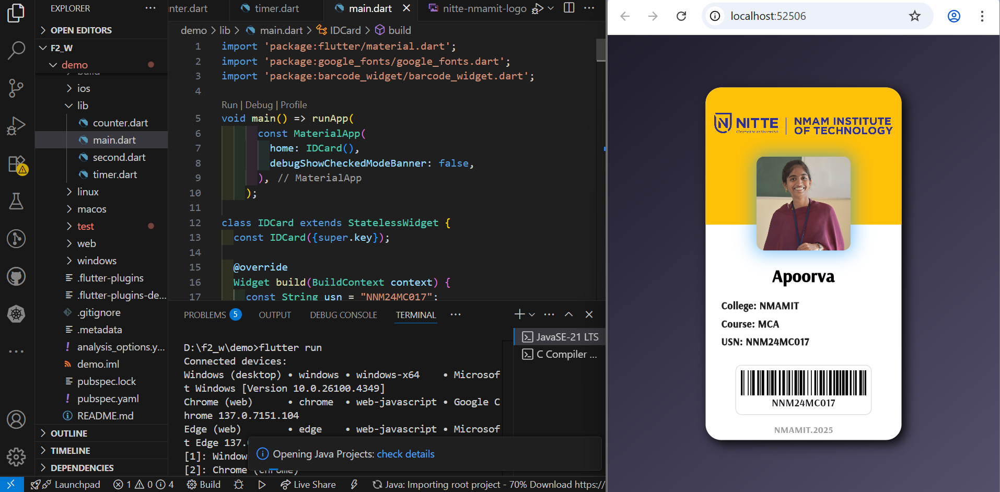

# 🪪 Flutter Student ID Card App

This Flutter project showcases a beautifully designed digital Student ID Card. It features a modern and responsive UI with a gradient background, animated profile image, institutional logo, and essential student details including name, course, college, and USN. A barcode is also generated using the barcode_widget package for encoding the USN, simulating real-world ID scanning features.

---

## 📱 App Preview

 
---

## 🧾 Features

- 🎨 Gradient background with smooth, rounded card
- 🖼️ Student profile image & institution logo
- 👨‍🎓 Displays name, USN, course, and college
- 🧬 Animated profile picture reveal
- 📦 Barcode (Code128) for USN
- 📆 Footer with graduation year (e.g., `NMAMIT.2025`)
- ✨ Modern fonts with Google Fonts & clean Material UI

---

## 📁 Folder Structure
```plaintext
flutter-id-card/
│
├── assets/
│   ├── Apoorva_poojary.jpg
│   └── nitte-nmamit-logo.jpg
│
├── lib/
│   └── main.dart
│
└── pubspec.yaml
```
## 🛠️ Configuration

### pubspec.yaml

Make sure you include assets and dependencies properly:

```yaml
flutter:
  assets:
    - assets/student_photo.jpg
    - assets/college_logo.jpg

dependencies:
  flutter:
    sdk: flutter
  google_fonts: ^6.1.0
  barcode_widget: ^2.0.4
```
---
## Run the App
- flutter run
- flutter run -d chrome
---
## Author
Apoorva MCA Student NMAMIT,Nitte
